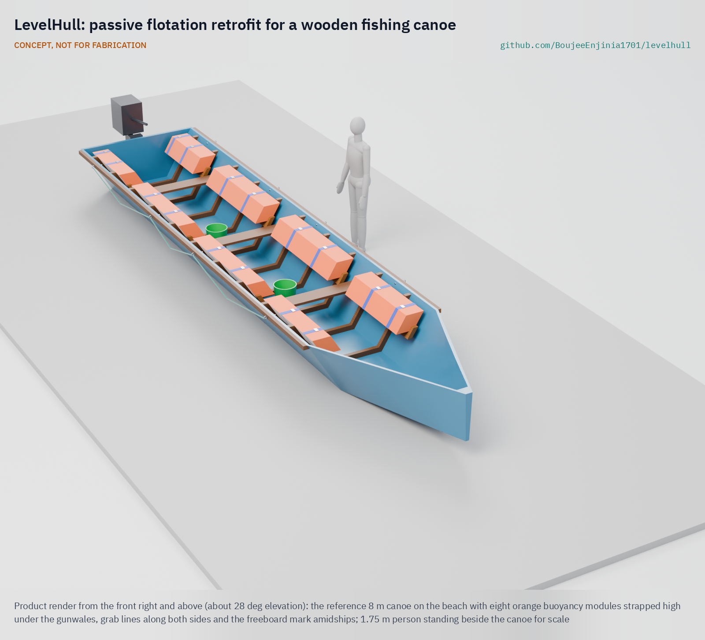

# LevelHull

   

**Area:** Food and water security · **TRL:** 3 of 9 (proof of concept on paper) · **Value-engineering target:** USD 1,000 for two prototype canoes (estimated cost of the constructable design USD 1,360) · **Difficulty:** 3 of 5

Adds passive buoyancy so a swamped wooden fishing canoe floats level and can be bailed.

> CONCEPT, NOT FOR FABRICATION. LevelHull is a TRL 3 design on paper: it has not been built or tested, it is not certified lifesaving equipment, and it is never a substitute for life jackets.

## Concept rationale

A swamped boat that stays afloat and upright is a platform the crew can hold, bail and paddle home. The US Coast Guard publishes a level flotation test that checks exactly this for small boats ([USCG](https://www.uscgboating.org/assets/PDF/downloads/FLOTATION.pdf)). Wooden fishing canoes in lakes and coastal waters elsewhere have no such built-in flotation. LevelHull is a retrofit kit: closed-cell foam modules fitted high along both sides of the hull, just under the gunwale, sized so that when a wave fills the canoe it floats level with freeboard, and the crew bails it out and carries on.

The kit is passive. Nothing moves, nothing inflates and nothing needs power, so it keeps working after years in the sun and in a wet hull. It is designed to be sized with a simple volume sheet and fitted by a local boatbuilder with hand tools. It is never a substitute for life jackets; it is a second layer for when a boat swamps.

## Burning platform

About 1,500 fishers drown on Lake Victoria every year, roughly 1,000 of them in bad weather; 69 % of those who drowned in storms wore no life jacket, and about half of incidents happen at night ([The Conversation](https://theconversation.com/lake-victoria-why-so-many-fishers-are-dying-and-what-can-be-done-about-it-232006)). Worldwide, more than 100,000 people die in fishing each year ([Pew, 2022](https://www.pew.org/en/research-and-analysis/issue-briefs/2022/11/more-than-100000-fishing-related-deaths-occur-each-year-study-finds)).

Progress is slowest where these boats are most common: the WHO African Region has cut its drowning rate by only 3 % since 2000 ([WHO, 2024](https://www.who.int/news/item/13-12-2024-drowning-deaths-decline-globally-but-the-most-vulnerable-remain-at-risk)). Certified lifesaving equipment is often not affordable or available there, which is why the RNLI supports locally built, sustainable lifesaving equipment in its international work ([RNLI](https://rnli.org/what-we-do/international/lifesaving-interventions/sustainable-lifesaving-equipment)).

## Where it could be used

### By industry

| Industry | Use |
| --- | --- |
| Small-scale capture fisheries | Retrofit flotation for wooden canoes on lakes, rivers and coasts |
| Boatbuilding (artisanal yards) | A documented add-on that local builders can size and fit |
| Fisheries management and safety at sea programmes | A low-cost measure alongside life jackets, weather warnings and training |
| Water transport and ferries on inland waters | Flotation for small wooden passenger and cargo canoes |
| Disaster response | Buoyancy modules reused in flood boats (for example the sibling LaneSkiff concept) |

### By country or region

| Country or region | Why it matters there |
| --- | --- |
| Lake Victoria (Kenya, Uganda, Tanzania) | About 1,500 fishers drown on the lake each year, about 1,000 in bad weather ([The Conversation](https://theconversation.com/lake-victoria-why-so-many-fishers-are-dying-and-what-can-be-done-about-it-232006)). |
| WHO African Region | The drowning rate has fallen by only 3 % since 2000 ([WHO, 2024](https://www.who.int/news/item/13-12-2024-drowning-deaths-decline-globally-but-the-most-vulnerable-remain-at-risk)). |
| Worldwide small-scale fisheries | More than 100,000 people die in fishing each year ([Pew, 2022](https://www.pew.org/en/research-and-analysis/issue-briefs/2022/11/more-than-100000-fishing-related-deaths-occur-each-year-study-finds)). |
| United States | The US Coast Guard publishes a level flotation test for small boats, the benchmark this kit will be tested against ([USCG](https://www.uscgboating.org/assets/PDF/downloads/FLOTATION.pdf)). |

## What sparked the idea

The idea started with the numbers from Lake Victoria: about 1,500 fishers drowning each year, most of them in bad weather, and 69 % of storm victims wearing no life jacket ([The Conversation](https://theconversation.com/lake-victoria-why-so-many-fishers-are-dying-and-what-can-be-done-about-it-232006)). Many of those deaths begin with a canoe filling with water. If a swamped canoe stayed afloat and level, the crew would have something to hold and a boat they could bail, even without a life jacket.

## Problem

Wooden fishing canoes swamp in storms and waves, and once full of water they can roll or sink, leaving the crew in the water. Most small-scale fishers in these boats cannot swim to shore and many wear no life jacket.

Full problem statement: [docs/01-problem.md](docs/01-problem.md)

## Concept

A retrofit kit of eight closed-cell polyethylene foam modules, four a side, fitted high under the gunwale on hardwood battens screwed to the canoe's frames and held by webbing straps. When a wave swamps the canoe, the modules cut the waterline along both sides, so it floats upright and level with about 100 mm of freeboard; the crew hold the grab lines, climb back in and bail. On paper, the 8 m reference canoe with a 15 hp motor and four crew holding on keeps 92 mm of freeboard at its lowest point, with 2.45 times the needed lift in reserve; the same foam laid on the floor would barely reach the surface and would lose all roll stiffness with a few kilograms more load. Never a substitute for life jackets.

Full design precis: [docs/02-concept.md](docs/02-concept.md) · Requirements: [docs/03-requirements.md](docs/03-requirements.md) · Calculations and sizing calculator: [docs/04-calcs/01-sizing.md](docs/04-calcs/01-sizing.md) · Prototype build plan: [docs/05-build-plan.md](docs/05-build-plan.md) · Design decisions: [docs/06-design-decisions.md](docs/06-design-decisions.md)

## Key components

- Eight buoyancy modules: four 50 mm layers of closed-cell polyethylene foam, 220 mm wide by 200 mm high, in sewn PVC tarpaulin covers
- Hardwood shelf battens screwed into the frames with M8 coach screws that stop short of the planks, and end chocks
- Two 50 mm webbing hold-down straps per module with stainless D-ring buckles
- Grab lines along both sides on through-bolted eye bolts
- Two bailers on lanyards, painted freeboard marks and a swamp test
- A plywood setting gauge for fitting, and an open sizing calculator for other canoes

## Building the prototype

The [prototype build plan](docs/05-build-plan.md) (LVH-BLD-001, plan, not yet built) is also the fitting guide for a local boatbuilder. It covers the kit component by component, with making sketches for the six made parts, close-ups of six joints and a picture for each of ten fitting steps. The foam is cut with a knife, the covers are sewn by a tailor, the battens are ripped and planed from hardwood, and everything is fitted with hand tools in about a day. No fitted canoe goes fishing before its fixings are pull-tested and it passes a swamp test in sheltered, shallow water with a safety boat and everyone in life jackets, which is TRL 4 work.

## Safety

> Published as an open engineering reference, not certified lifesaving equipment.
>
> LevelHull is never a substitute for life jackets. Crews should wear life jackets whenever they are on the water.
>
> A swamped boat with flotation is still at risk in breaking waves and cold water; the kit buys time, it does not make a boat safe.
>
> Each fitted canoe must be swamp-tested in sheltered, shallow water with safety cover before use.
>
> Modules must be fixed so they cannot tear free when the boat is full of water; each fixing carries at least twice its share of the full lift.
>
> With all four crew holding one side, the low gunwale comes within about 30 mm of the water: spread out along both grab lines.
>
> This design is published as an open engineering reference. It is not certified equipment.

## Repository layout

| Folder | Contents |
| --- | --- |
| `docs/` | Problem, concept, requirements, calculations and design decisions |
| `cad/src/` | build123d Python source, the source of truth for all geometry |
| `cad/step/`, `cad/stl/` | Exported models for FreeCAD, other CAD tools and printing |
| `cad/drawings/` | 2D sketches and dimensioned drawings |
| `bom/` | Bill of materials |
| `electronics/` | KiCad schematics and PCB layouts |
| `firmware/` | Microcontroller code |
| `media/` | Renders, perspectives and photos |
| `build-log/` | Dated prototyping notes |

## Documentation

Controlled documents follow the portfolio [documentation standard](.kit/STANDARDS.md). Each carries a document ID (LVH-PRC-001 for the precis), a version and a revision history. Branded PDFs are built with `python .kit/render.py` and attached to GitHub Releases when a document is tagged, for example `LVH-PRC-001/v1.0`.

## Credits

Designed by Amish Chadha at Design Molecule Labs. See [CONTRIBUTORS.md](CONTRIBUTORS.md) for roles. To cite this design, use [CITATION.cff](CITATION.cff) (GitHub shows it as "Cite this repository").

AI assistance (Claude) was used to accelerate prototype documentation and first-pass research. Design direction and all decisions are Amish Chadha's, recorded in this repository's decision records (`docs/decisions/`).

## Licenses

- **Hardware** (CAD, drawings, BOM, electronics): [CERN-OHL-S v2](LICENSE)
- **Software** (firmware, scripts, notebooks): [MIT](LICENSE-SOFTWARE)

A project of the [Design Molecule](https://designmolecule.com) lab.
