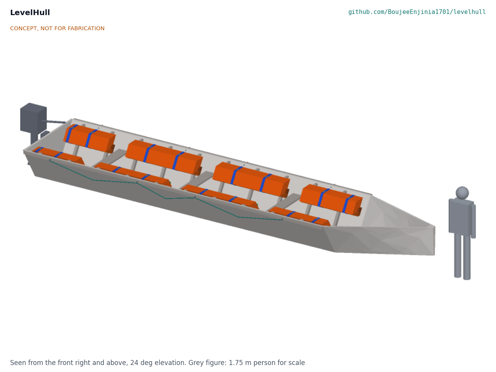
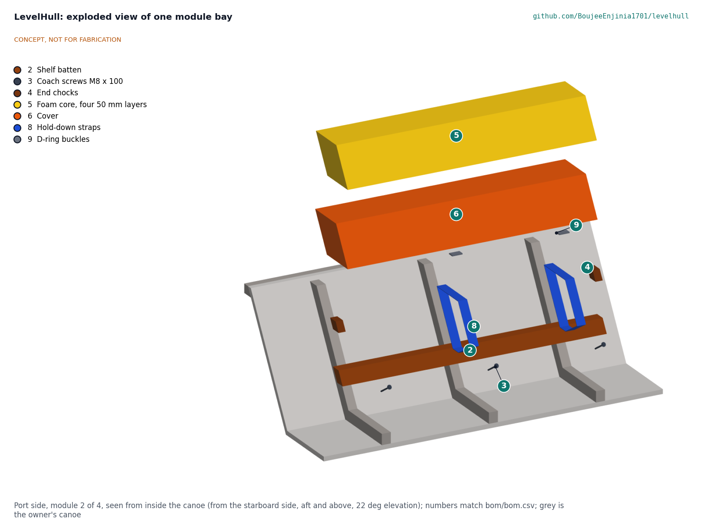

# LevelHull design precis

Adds passive buoyancy so a swamped wooden fishing canoe floats level and can be bailed.

*Figure 1. The kit fitted in the 8 m reference canoe, with a 1.75 m person for scale (concept render).*

## How it works

Eight buoyancy modules of closed-cell polyethylene foam, four on each side, sit high along the inside of the canoe, just under the gunwale, between the thwarts. Each module rests on a hardwood shelf batten screwed to the canoe's frames and is held down by two webbing straps. When a wave fills the canoe, the water inside is simply part of the lake: it carries nothing, and the canoe now floats on its foam and timber alone. Because the modules are high, they cut the waterline along both sides, like the floats of a raft, so the swamped canoe floats upright and level with its gunwale about 100 mm out of the water. The crew hold the grab lines along both sides, then climb in and bail with the two bailers. A painted freeboard mark on each side and a swamp test in sheltered water let the owner check the fit.

*Figure 2. Cut across the canoe through module 2: the modules lie on the frame faces under the gunwale.*

## Components

*Table 1. Components (numbers are BOM lines in `bom/bom.csv`).*

| # | Component | Role |
| --- | --- | --- |
| 1 | Setting gauge | Plywood fitting tool that marks the batten height on every frame |
| 2 | Shelf battens | Hardwood rails screwed to the frames; each carries one module |
| 3 | Coach screws M8 x 100 | One into every frame a batten crosses; take the module's lift into the frames |
| 4 | End chocks | Stop the module sliding fore and aft |
| 5 | Foam cores | Four 50 mm layers of closed-cell polyethylene foam: the buoyancy |
| 6, 7 | Covers | Sewn PVC tarpaulin sleeves that shield the foam from sun, fuel and abrasion |
| 8, 9 | Hold-down straps and D-ring buckles | Two webbing loops per module round module and batten |
| 10, 11 | Grab-line eye bolts and grab lines | Something to hold for the crew in the water |
| 12 | Bailers | Two 10 L buckets on lanyards |
| 13 | Swamp test kit | Painted freeboard marks and an inclinometer for the swamp test |
| 14 | Sealer | Seals batten ends, chocks and every screw hole |
| (calc) | Sizing calculator | `docs/04-calcs/sizing.py` sizes the modules for any canoe (MIT) |
| (BLD) | Fitting guide | The build plan, LVH-BLD-001 |

*Figure 3. One module bay pulled apart; numbers match the BOM.*

## Key design choices

All decided under Amish's pre-approval of 2026-10-03 (LVH-DDR-001 and LVH-DDR-002).

- **High, not low.** Modules under the gunwale give the swamped canoe roll stiffness; on the floor the same foam leaves it nearly neutral in roll (Table 2).
- **Foam, not chambers.** Closed-cell polyethylene foam keeps its lift when cut or punctured and resists fuel. Polystyrene is excluded (fuel dissolves it), as is open-cell foam (it soaks up water).
- **No credit for the wood.** Wet timber is counted as exactly as dense as water. Lighter timber is a margin, not part of the design.
- **Into the frames, not through the hull.** Battens are screwed into the frames with coach screws that stop 10 mm short of the planking; the only new hull holes are the eight eye bolts in the top plank, above every waterline.
- **Simple parts a beach yard can make.** Ripped hardwood battens, foam strips cut with a knife, sewn tarpaulin sleeves and webbing loops with D-rings; no glue, no moving parts.
- **One reference canoe, a calculator for the rest.** The design is checked on an 8 m, 1.6 m beam canoe with a 15 hp outboard and four crew; the calculator gives the module run for other hulls.

## First-order numbers

From LVH-CAL-001 (`docs/04-calcs/sizing.py`); fresh water, design load unless stated.

*Table 2. First-order numbers.*

| Quantity | Value | Assumption |
| --- | --- | --- |
| Modules | 8, each 220 mm wide x 200 mm high, 4.78 m a side, 0.42 m3 | Reference canoe, thwarts at 1.2, 3.0 and 4.8 m |
| Design net load | 118 kg | Four crew holding on (20 % of 75 kg each), 36 kg motor, anchor, nets, catch |
| Freeboard, swamped | 113 mm amidships, 92 mm lowest (transom) | Timber at 1,000 kg/m3; trim 0.39 deg stern down |
| Reserve | Carries 290 kg at 50 mm freeboard: 2.45 times the design load | |
| Roll stiffness | 761 kg m per radian (metacentric height 3.1 m) | Waterplane of modules and planks |
| Same foam on the floor | Foam top just at the water: heels 10.6 deg with four crew on one side, and no roll stiffness at all with 5 kg more load | For comparison only |
| Four crew on one side | 3.9 deg heel, 44 mm freeboard on the low side | |
| Largest module lost and 5 % water uptake | Still floats, 25 mm freeboard | |
| Bailing to 200 mm freeboard | 1.17 m3, about 6 minutes for two crew (estimate) | 100 L per minute each, calm water |
| Kit mass | 69 kg; dry canoe sits about 11 mm deeper | |
| Share of the inside volume | 8.4 % | |
| Parts cost | USD 682 per canoe; USD 1,360 for two | Value-engineering target USD 1,000 for two |

## Patent design-arounds

From the preliminary patent, trademark and prior-art screen (not legal advice):

- Passive foam only; no inflation and no inflation mechanism (avoids US9139267B2, active to about 2032). Sealed chambers are not used either.
- The hull-volume sizing method is published openly in `docs/04-calcs/sizing.py` under MIT.

## Shared blocks

- Foam module and fixing pattern offered to the sibling LaneSkiff concept (proposed there, not here).
- CalRig proof-load for strap and screw pull-out at TRL 4.

## Safety

> **Safety:** LevelHull is published as an open engineering reference, not certified lifesaving equipment. It is never a substitute for life jackets: crews should wear life jackets whenever they are on the water. A swamped canoe with flotation is still at risk in breaking waves, at night and in cold water; the kit buys time to bail and be seen, it does not make the boat safe. With all four crew holding one side the low gunwale comes within about 30 mm of the water, so crews spread out along both grab lines. Every fitted canoe has its fixings pull-tested and is swamp-tested in sheltered, shallow water with a safety boat and every person in a life jacket before use (LVH-BLD-001, sections 5 and 6). The modules must be fixed so they cannot tear free when the canoe is full of water; each fixing carries at least twice its share of the full lift.

This design is published as an open engineering reference. It is not certified equipment.

## Open questions

None for the design; decisions are in the register (`docs/06-design-decisions.md`), and facts that need real hulls and parts are listed there under "To confirm when parts are bought".
