# LevelHull prototype build plan

**Plan, not yet built.** How to make the flotation kit and fit it to the first canoe, component by component. Building and testing to it is TRL 4 work. Decisions are kept in the design decisions register (`docs/06-design-decisions.md`), not here.

> **Safety:** LevelHull is flotation for the boat. It is never a substitute for life jackets, and it is not certified lifesaving equipment. The fitted canoe is not used for fishing until it has passed the fixing pull test and a swamp test in sheltered, shallow water with a safety boat and every person in a life jacket (sections 5 and 6). Work with power tools and solvents needs eye protection and air.

## 1. What you are building

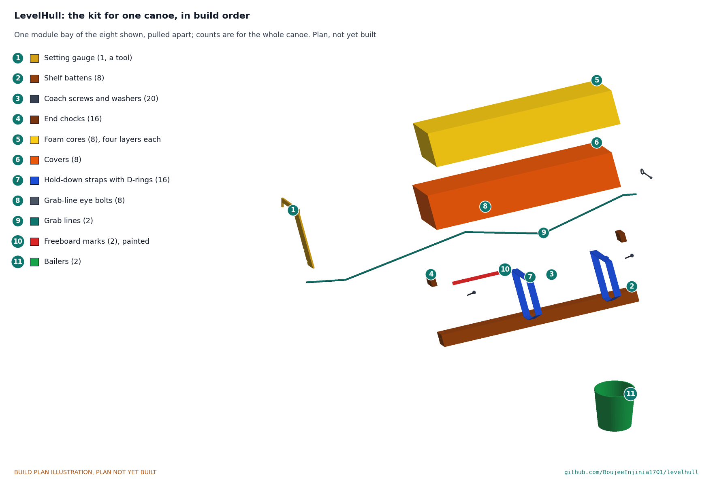

*Figure 1. The kit for one canoe, in build order. One of the eight module bays is shown; the counts are for the whole canoe.*

The kit turns an ordinary planked fishing canoe into one that floats upright when it fills with water. It has eight buoyancy modules, four along each side, high under the gunwale between the thwarts. Each module is four layers of closed-cell foam in a sewn tarpaulin sleeve, sitting on a hardwood shelf batten that is screwed into the canoe's frames, held down by two webbing straps and kept from sliding by a wooden chock at each end. Grab lines along both sides, two bailers and a painted freeboard mark on each side complete it. Five parts are made (a plywood setting gauge, the battens, the chocks, the foam cores and the covers); the rest are bought. Parts cost about USD 682 per canoe. The sizes are for the reference canoe, 8.0 m long, 1.6 m in beam and 0.65 m deep with a 15 hp outboard; measure each canoe and size it with the calculator first.

## 2. What changed to make it buildable

*Table 1. Changes from the concept.*

| Component | The concept had | The buildable design has | Why |
| --- | --- | --- | --- |
| Modules | Blocks low along the sides | High under the gunwale, top 30 mm below it, lying on the frame faces | Upright when swamped |
| Module shape | Rectangular blocks, one per side | Four per side between the thwarts, each a stack of four equal foam strips cut to the side slope, 220 mm wide and 200 mm high | Sits flat on the sloping frames; light to handle |
| Seat | "Cleats" | A hardwood shelf batten under each module | Gives the straps an anchor and spreads the lift over the frames |
| Fixings | Not specified | One coach screw into every frame a batten crosses, stopping short of the planks | No new holes in the planks below the waterline |
| End stops | None | A chock at each end of each module | Stops the module creeping fore and aft |
| Straps | "Fixing straps" | Closed webbing loops round module and batten, in the bays between frames, with D-ring buckles | No separate anchor; nothing to corrode or jam |
| Covers | "Protective covers" | Sewn tarpaulin sleeves with laced ends | Made and replaced by a tailor; foam can be checked |
| Fitting | Measured by hand | A plywood setting gauge for the batten height | Same height on every frame |
| Hand holds | None | Grab lines on four eye bolts a side | Something for the crew to hold in the water |

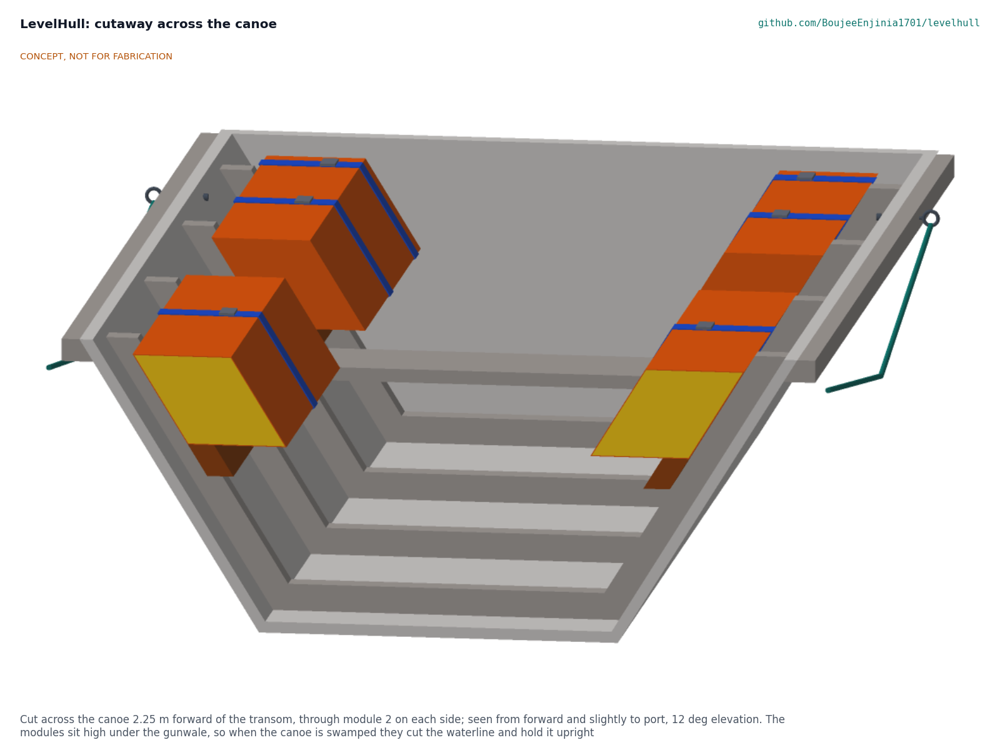

*Figure 2. Cut across the canoe through module 2: the modules lie high on the frame faces.*

## 3. Making the components

Make the foam cores and covers in the workshop before the canoe comes in, so the fitting takes one day.

### 3.1 Setting gauge

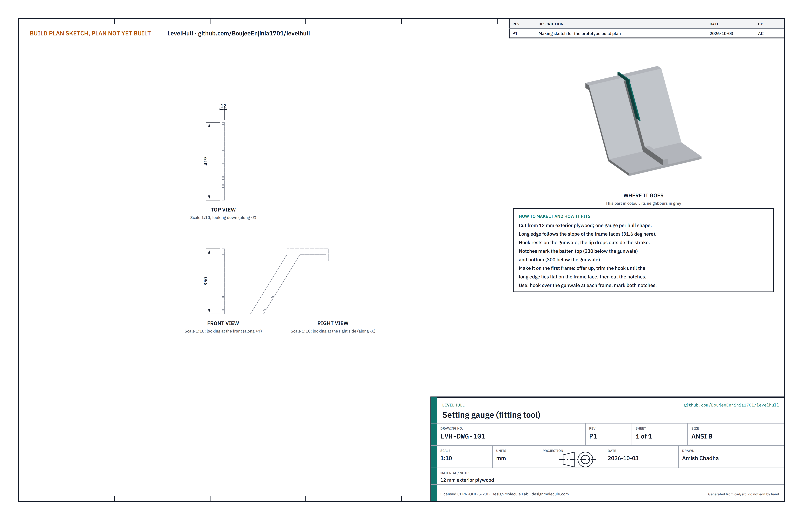

**What it is and what it is made from.** A fitting tool: a strip of 12 mm exterior plywood about 450 mm long and 70 mm wide with a hook at the top. Hooked over the gunwale at a frame, it lies flat on the frame's inner face and its two notches show where the top and bottom of the shelf batten go. One gauge serves every canoe of the same shape.

**How to make it.**

1. Cut a plywood blank about 360 x 450 mm.
2. Mark the long edge at the slope of the canoe's side, measured on the first frame with a bevel gauge (31.6 deg from upright on the reference canoe).
3. Cut the strip 70 mm wide along that edge, with the hook at the top: a 30 mm thick bar across the gunwale and a 35 mm lip that drops outside the rubbing strake.
4. Offer it up at the first frame. Trim the underside of the hook until the long edge lies flat on the frame face from the gunwale down.
5. Cut two saw notches, 12 mm deep, on the long edge: the top of the batten 230 mm below the top of the gunwale, and the bottom 300 mm below it, measured straight down.

**How it fits the parts next to it.**

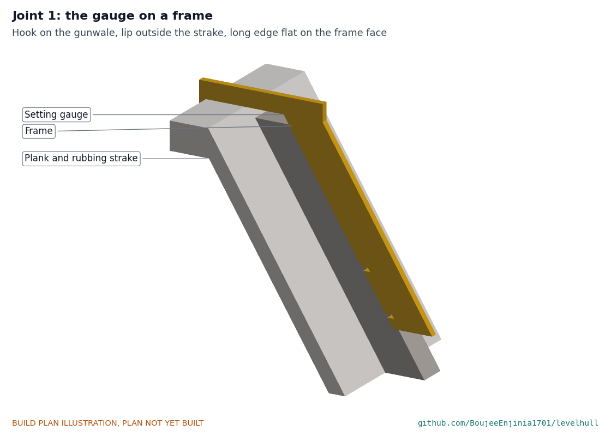

*Figure 3. The gauge hooked over the gunwale, its long edge on the frame face.*

The hook rests on the top of the planking and rubbing strake; the lip touches the outside of the strake; the long edge lies on the frame face.

**Check before moving on.** On three frames along the canoe, the gauge sits flat with no rocking and the hook seats fully.

### 3.2 Shelf battens

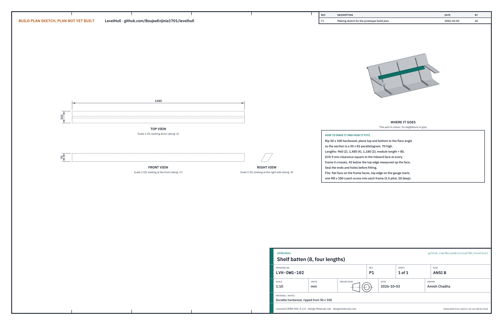

**What it is and what it is made from.** Eight hardwood rails, one under each module, from 50 x 100 mm durable hardwood. Each is 50 mm thick square to the frame faces and 70 mm high, with the top and bottom cut level, so its section is a 50 x 82 mm parallelogram. Lengths: two of 960 mm, four of 1,480 mm and two of 1,180 mm (each module length plus 80 mm).

**How to make it.**

1. Rip the stock to about 85 mm.
2. Plane the top and bottom edges to the side slope (31.6 deg from square on the reference canoe) so both are level when the wide face lies on the frames; finished height 70 mm.
3. Cut to length.
4. Lay the batten against the canoe at its marks and mark the centre of every frame it crosses on its inboard face, 45 mm below the top edge measured up the face.
5. Drill 9 mm clearance holes there, square to the face.
6. Seal the ends and holes; cut the chocks for the same module from the offcut (section 3.3).

**How it fits the parts next to it.**

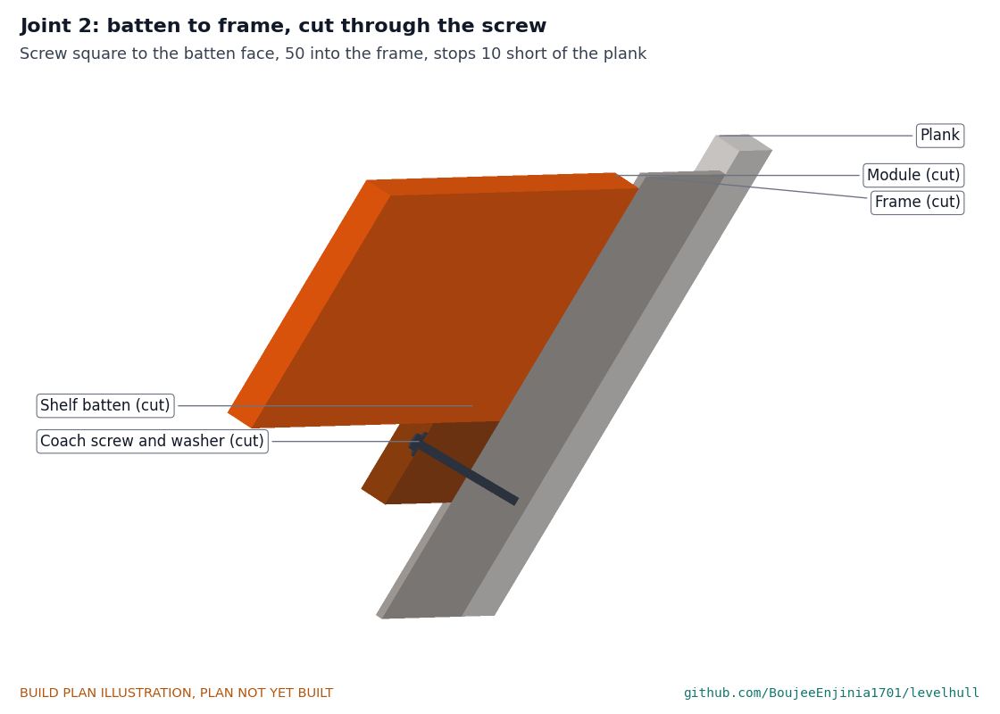

*Figure 4. Batten on a frame, cut through the coach screw. The screw goes 50 mm into the frame and stops 10 mm short of the plank.*

The wide face lies on the frame faces; the top edge is on the upper gauge mark. One M8 x 100 coach screw with a 24 mm washer goes through each hole into the frame, in a 5.5 mm pilot hole 50 mm deep. The module sits on the top edge.

**Check before moving on.** Each batten touches every frame it crosses; a straightedge laid on the tops of the two battens of one module bay shows them level with each other across the canoe.

### 3.3 End chocks

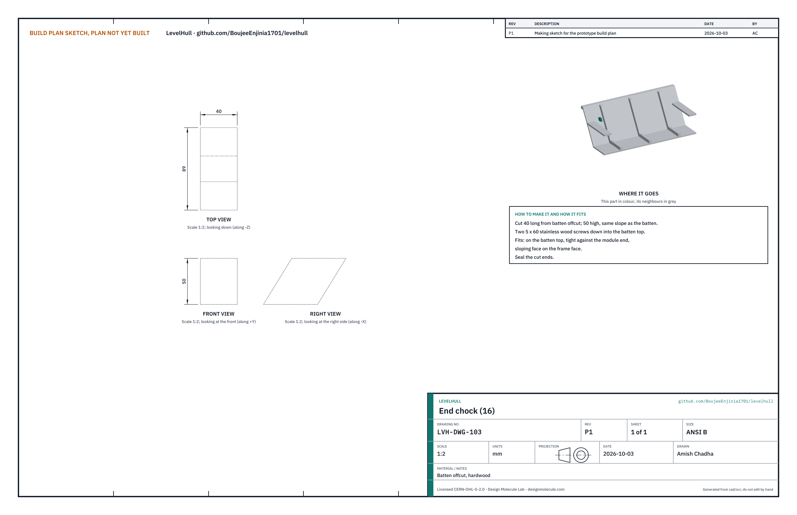

**What it is and what it is made from.** Sixteen hardwood blocks from batten offcut, 40 mm long, 50 mm high and the batten's width, with the same sloping outboard face.

**How to make it.**

1. Cut the offcut to 40 mm lengths.
2. Trim each to 50 mm high, keeping the sloping face.
3. Drill two 4 mm pilot holes down through each and seal the cut ends.

**How it fits the parts next to it.**

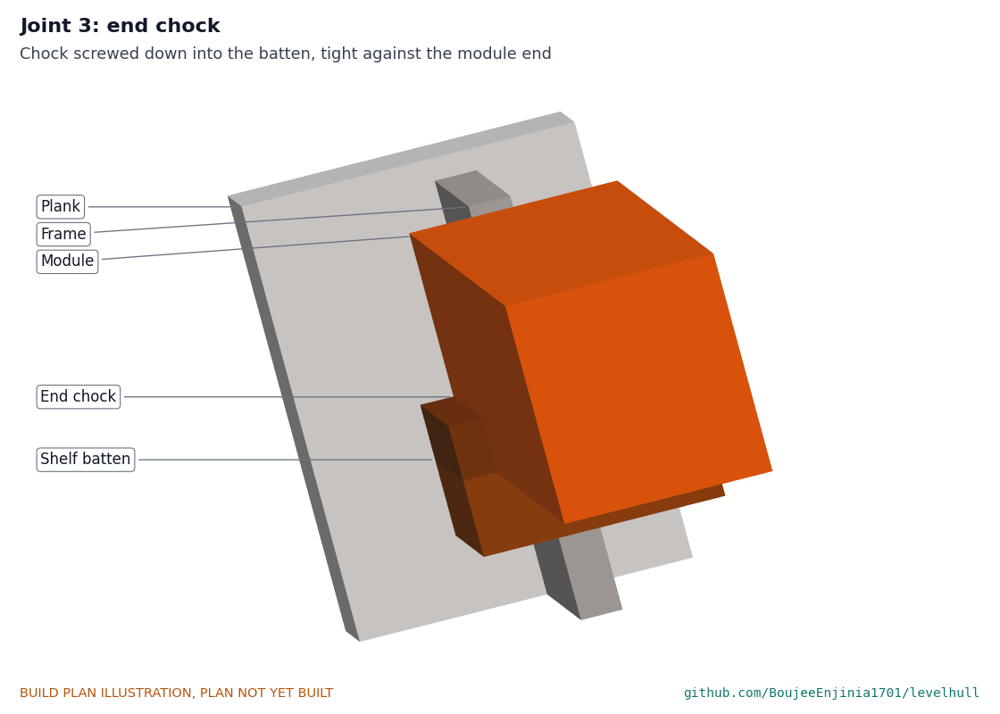

*Figure 5. An end chock on the batten, against the end of the module.*

The chock sits on the batten top at the end of the module, sloping face against the frame line, screwed down with two 5 x 60 mm stainless screws. The gap between the two chocks of a batten is the module length plus 5 mm.

**Check before moving on.** The chock does not move when pushed by hand.

### 3.4 Foam cores

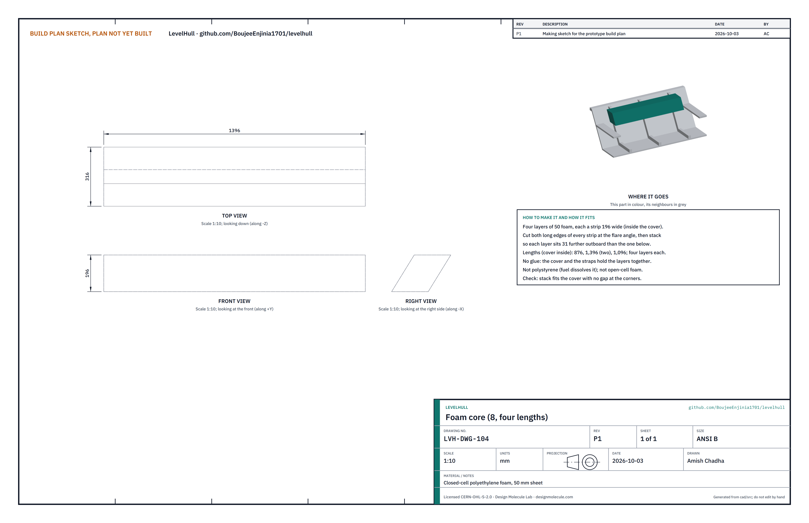

**What it is and what it is made from.** Eight stacks of four layers of 50 mm closed-cell polyethylene foam (about 30 kg/m3), cut from 2,000 x 1,000 mm sheets. Not polystyrene, which fuel dissolves, and not open-cell foam, which soaks up water.

**How to make it.**

1. Cut the sheets into strips 216 mm wide (measured level), with both long edges cut at the side slope, using a long knife or hot wire against a straightedge; four strips come from each sheet, which uses all 24 strips from the six sheets. Keep the narrow strip left at the edge of each sheet for the water uptake samples.
2. Cut the strips to length: 876 mm (8 strips), 1,396 mm (16) and 1,096 mm (8).
3. Stack four strips of the same length, each set 31 mm further outboard than the one below, so the stack's faces are flat parallelograms. No glue.

**How it fits the parts next to it.** The stack slides into its cover (section 3.5), sloping side to the frames.

**Check before moving on.** A stack fits its cover with no gap at the corners, and each strip has no cracks or tears.

### 3.5 Covers

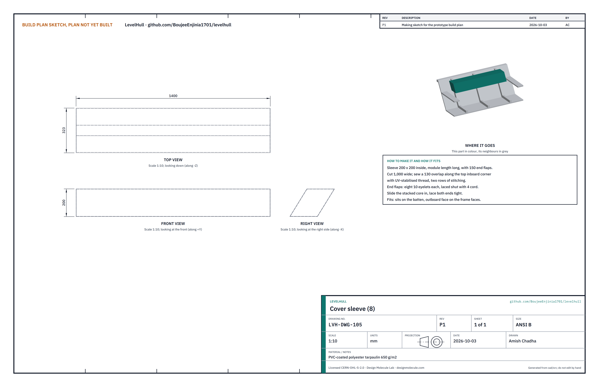

**What it is and what it is made from.** Eight sleeves of PVC-coated polyester tarpaulin, 650 g/m2, UV stabilised, sewn with UV-stabilised polyester thread. Inside size 220 mm wide by 200 mm high by the module length (880, 1,400 or 1,100 mm), with 150 mm flaps at each end.

**How to make it.**

1. Cut a panel 1,040 mm wide by the module length plus 300 mm.
2. Fold it round a stacked core and sew a 130 mm overlap along the top inboard corner with two rows of stitching.
3. Set eight 10 mm eyelets in each end flap.
4. Slide the core in, fold the flaps and lace them shut with 4 mm cord.

**How it fits the parts next to it.** The covered module sits on its batten between the chocks, its sloping face on the frame faces; the straps go round it (section 3.6).

**Check before moving on.** The laced ends are tight and the stitching has no gaps.

### 3.6 Hold-down straps with D-rings

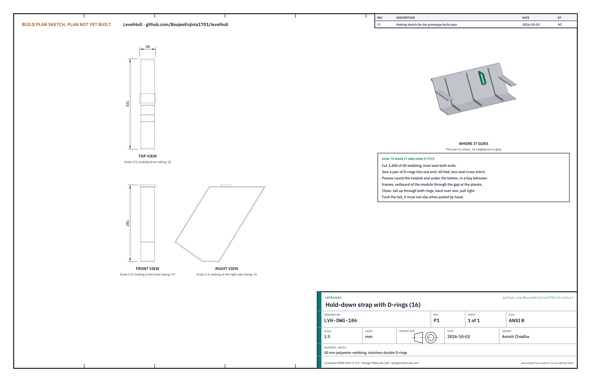

**What it is and what it is made from.** Sixteen loops of 50 mm UV-stabilised polyester webbing, about 1.25 m long, each with a pair of stainless double D-rings sewn into one end.

**How to make it.**

1. Cut 1.25 m of webbing; heat-seal both ends.
2. Fold 60 mm of one end round both D-rings and sew it with a box-and-cross stitch.

**How it fits the parts next to it.**

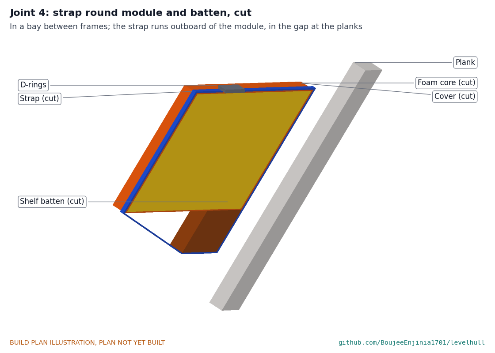

*Figure 6. A strap round module and batten, cut through the strap. It runs outboard of the module in the gap between the frames.*

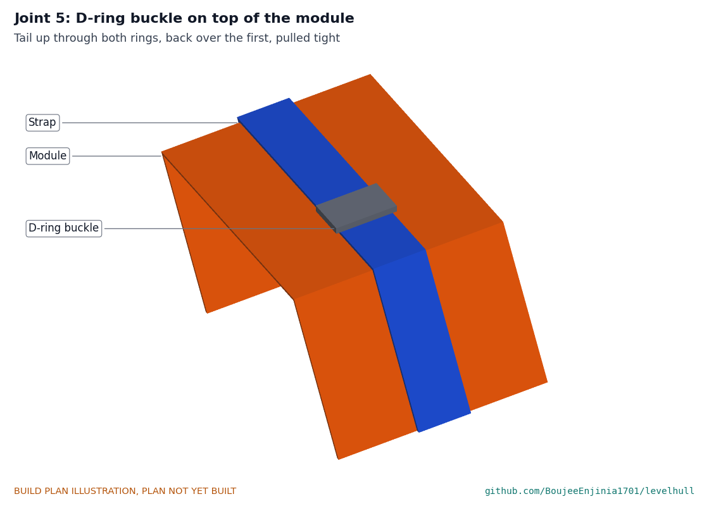

*Figure 7. The D-ring buckle on top of the module.*

Each strap goes in a bay between two frames, under the batten, up between the module and the planks, over the top of the module and down its inboard face. The tail goes up through both rings, back over the first and is pulled tight.

**Check before moving on.** Pulled hard by hand, the buckle does not slip.

### 3.7 Coach screws (bought)

Twenty-four M8 x 100 mm hex coach screws with 24 mm washers, stainless A4 or hot-dip galvanised (20 fitted, 4 spare). Bed each in sealer.

### 3.8 Grab-line eye bolts and grab lines (bought)

Eight M8 x 100 mm stainless eye bolts with 30 mm eyes, washers and nyloc nuts; 14 m of 12 mm polyester three-strand rope.

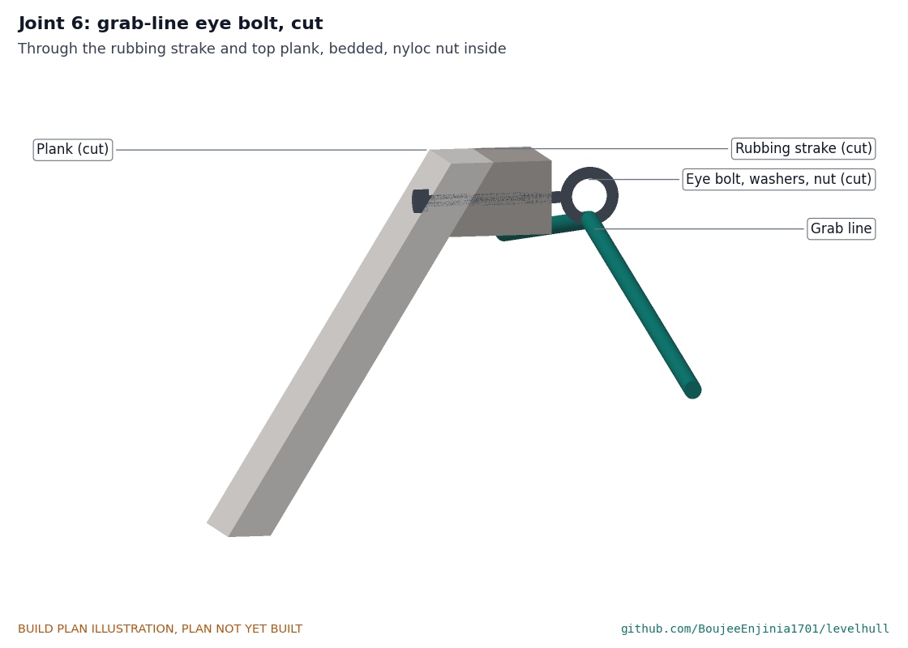

*Figure 8. An eye bolt through the rubbing strake and top plank, nut inside.*

Drill 8 mm through the rubbing strake and top plank, 25 mm below the gunwale top, between frames, at 0.6, 2.4, 3.6 and 5.4 m from the transom on each side. Bed the bolt in sealer and tighten the nut inside against a washer.

### 3.9 Bailers and swamp test kit (bought)

Two 10 L plastic buckets with 1.5 m lanyards of 6 mm rope; orange marine enamel, masking tape and a bubble inclinometer reading to 1 deg; sealer for the battens, chocks and holes.

## 4. Putting it together

Steps 1 to 7 show module 2 on the port side; repeat them for all eight bays. Start with the canoe dry, empty and level on the beach, supported under the keel line.

### Step 1: mark the batten heights with the gauge

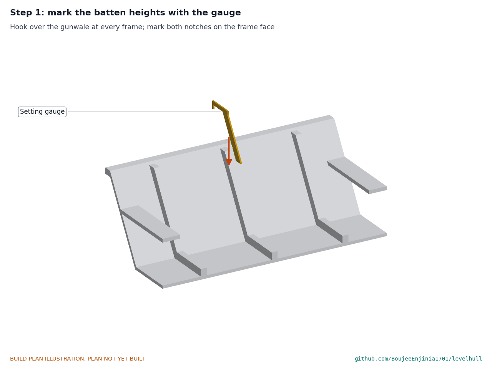

Hook the gauge over the gunwale at every frame the battens will cross and mark both notches on the frame face. Check that the thwarts and frames are sound before going on.

### Step 2: hold each batten to its marks

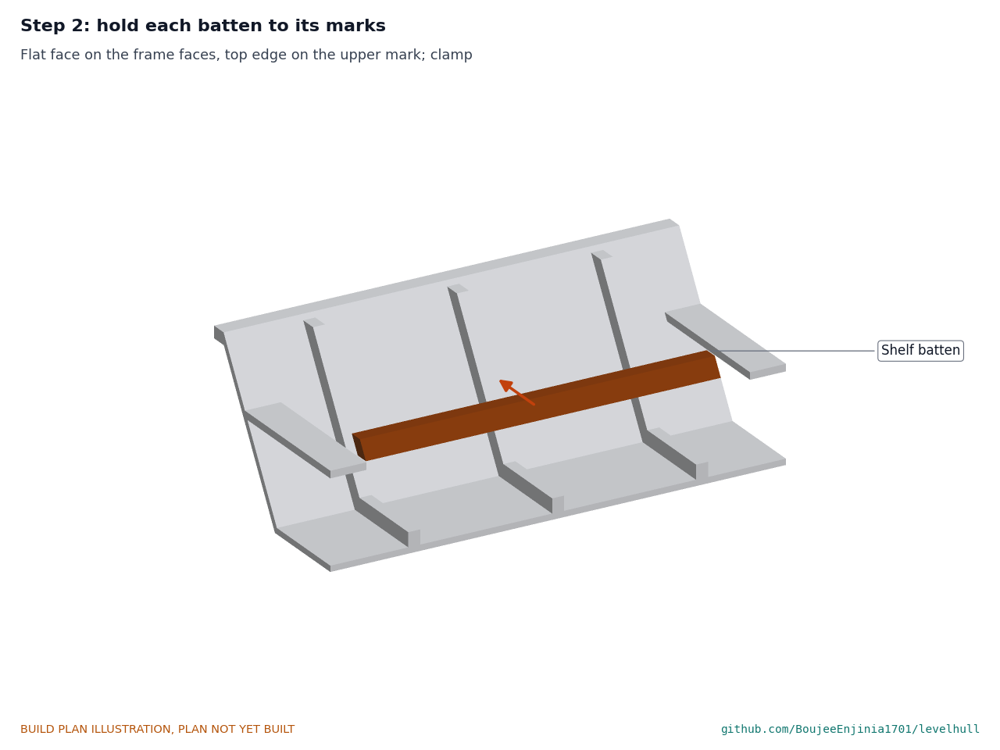

Lay the batten's wide face on the frame faces with its top edge on the upper marks, and clamp it.

### Step 3: drill and drive the coach screws

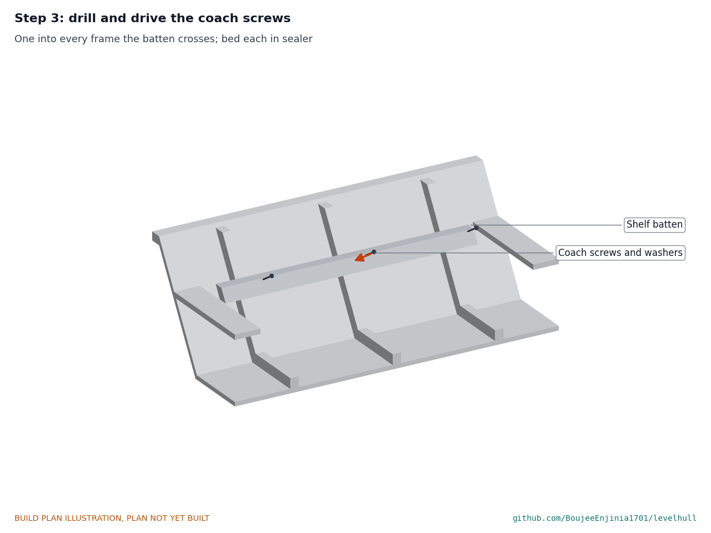

Through each clearance hole, drill a 5.5 mm pilot 50 mm deep into the frame, square to the batten face. Put a tape flag on the drill bit at the depth so it cannot reach the plank. Drive the screws with their washers, bedded in sealer, until snug.

### Step 4: screw the end chocks to the batten

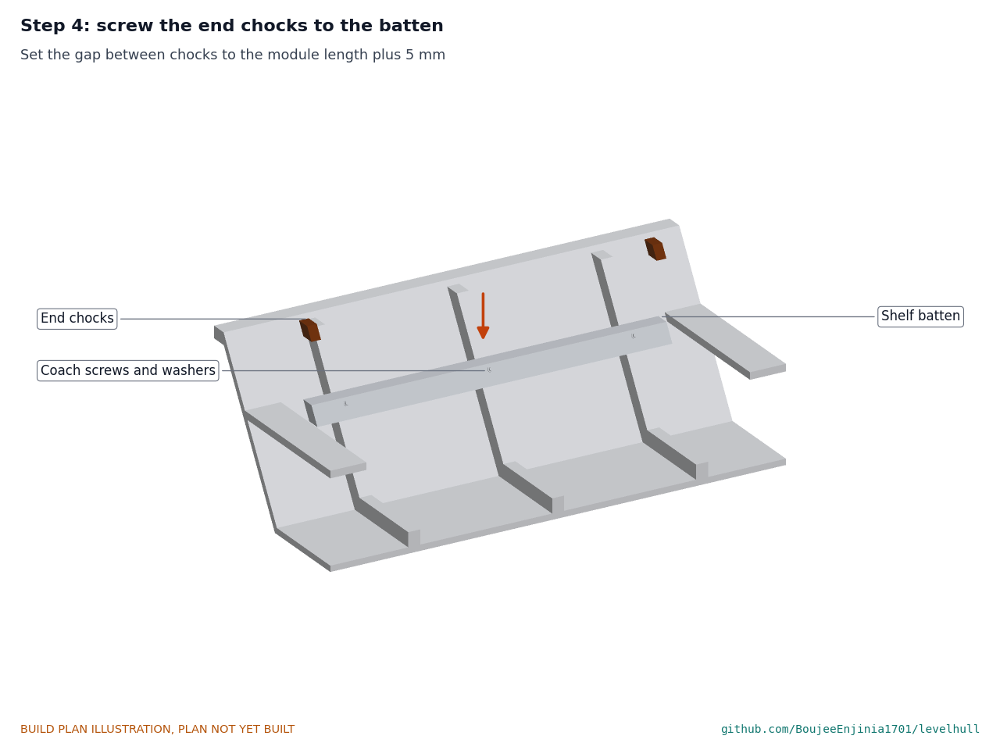

Set the aft chock at the batten's aft end mark, then the forward chock so the gap is the module length plus 5 mm. Two screws each.

### Step 5: lay the straps

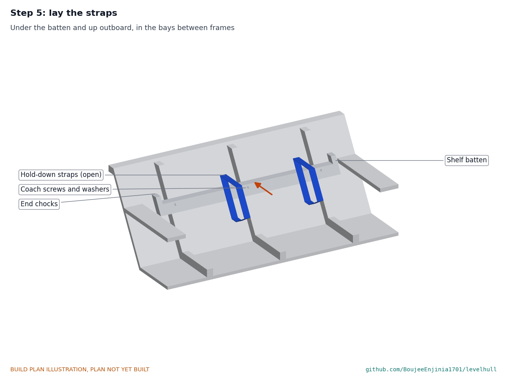

Pass two straps, open, under the batten and up the outboard side in the bays between frames, with the D-ring ends hanging inboard.

### Step 6: set the module on the batten

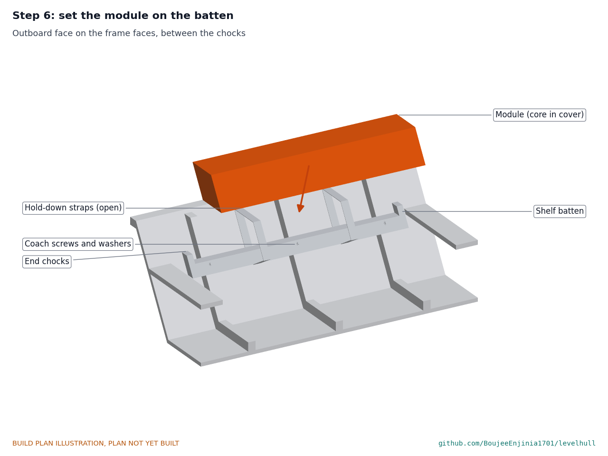

Lower the covered module onto the batten between the chocks, sloping face on the frames, laced ends at the chocks.

### Step 7: close the straps

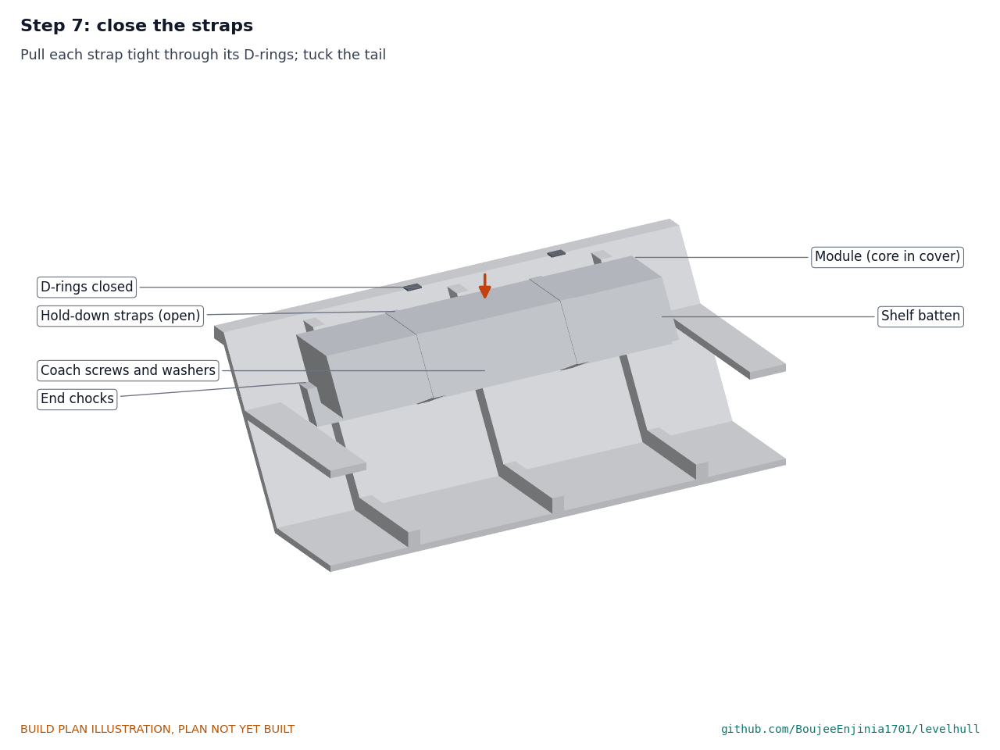

Bring each strap over the top and close it through its D-rings. Pull tight and tuck the tail under the strap.

### Step 8: fit the grab-line eye bolts

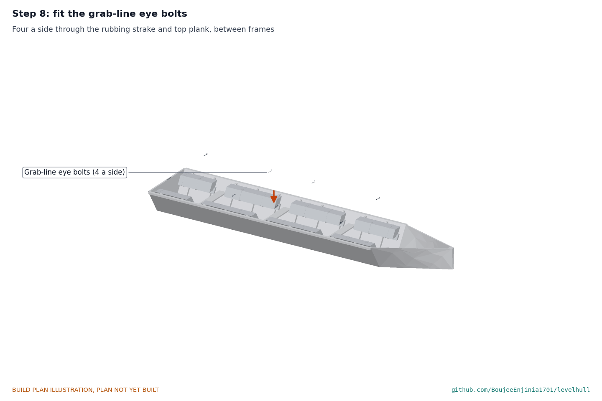

Fit four eye bolts a side (section 3.8), between frames.

### Step 9: reeve the grab lines

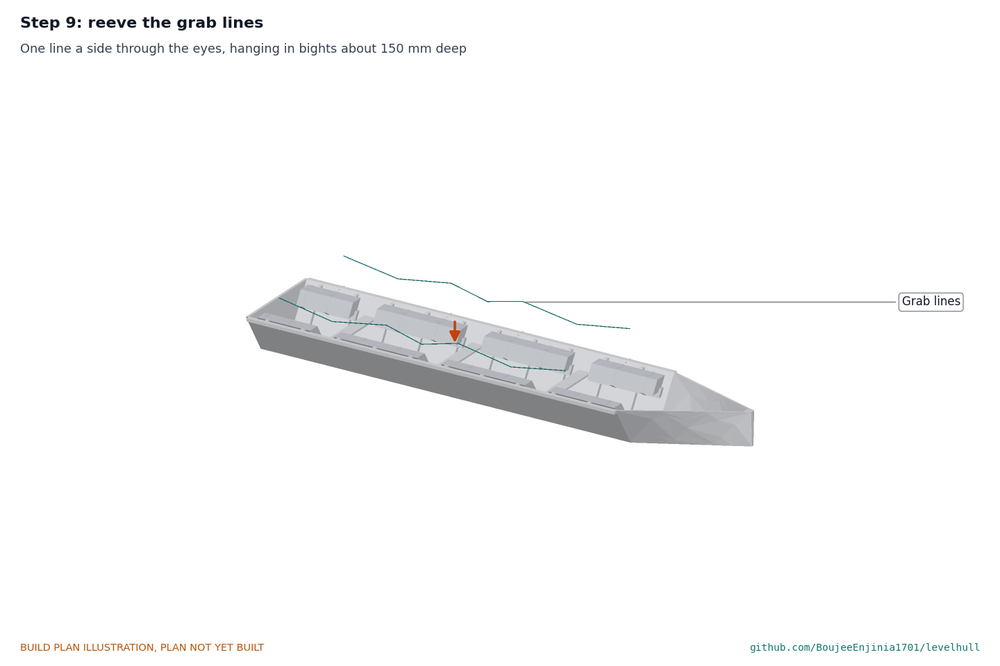

Tie one end to the aft eye, pass the line through each eye, leaving a bight about 150 mm deep between eyes, and tie off at the forward eye.

### Step 10: paint the freeboard marks, stow the bailers

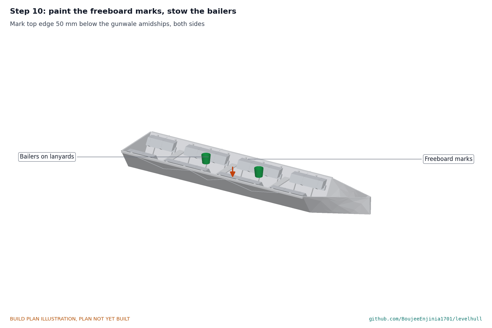

Mask and paint a 20 mm orange band on the outside of each side amidships (2.9 to 3.3 m from the transom), its top edge 50 mm below the top of the gunwale. Tie the bailers to a thwart and stow them on the floor between frames.

## 5. First checks

*Table 2. First checks (the plan lists them; a TRL 4 test report records them).*

| Check | Requirement | How | Pass when |
| --- | --- | --- | --- |
| Fit | R5 | Measure the space between the module tops; walk the canoe | 900 mm or more clear; thwarts, nets and motor controls usable |
| Batten pull | R7 | Hand pull on every batten; one bay loaded upward through its straps to 1.1 kN (twice the full lift of a 1,400 mm module) | No movement, no cracking at the frames |
| Strap hold | R7 | Pull each strap tail hard by hand | No slip at the D-rings |
| Swamp test, design load | R1, R2, R3, R11 | In sheltered water under 1.2 m deep, fill the canoe with motor and gear aboard and four crew holding on in life jackets; read freeboard and inclinometer after 1 hour | Afloat; water below both freeboard marks; heel and trim within 10 deg |
| Crew on one side | R13 | All four crew hold one grab line | Heel within 10 deg |
| One module out | R12 | Remove the largest module and repeat | Still afloat |
| Bail-out | R4 | Two crew bail with the two bailers, timed | 200 mm freeboard within 15 minutes |
| Fitting time | R8 | Time the fitting on the second canoe | One working day |

## 6. Safety stops

Work stops at each point below until what is listed is true.

- **S1, before drilling the frames:** frames and their fastenings to the planks are sound; the drill depth flag is set at 50 mm.
- **S2, before the first swamp test:** every batten passed the pull check, every strap passed the hold check, and the canoe's owner has agreed to the test.
- **S3, before anyone enters the water:** a powered safety boat with a crew is standing by, the water is sheltered and under 1.2 m deep, there is no wind over force 3 and no rain or lightning, it is daylight, and every person wears a life jacket.
- **S4, before filling the canoe:** the motor is off, its fuel tank closed and tied in, and nobody is near the propeller.
- **S5, before fishing use:** the swamp test at design load has passed and the owner has been shown the freeboard marks and told that the kit never replaces life jackets.

## 7. Tools, skills and workspace

- Workshop: a table saw or ripping saw and a hand plane for the battens; a long knife or hot wire and a straightedge for the foam; a sewing machine for heavy canvas, or a tailor or sail maker; an eyelet punch.
- At the canoe: a bevel gauge, clamps, a drill with 4, 5.5, 8 and 9 mm bits and a depth flag, a 13 mm socket wrench, screwdrivers, masking tape and a brush.
- Skills: a canoe builder or carpenter for the battens and screws; a tailor or sail maker for the covers.
- Workspace: shade and a level place on the beach for the canoe; a sheltered shallow place with a safety boat for the swamp test.

## 8. Where the numbers come from

- Model and checks: `cad/src/model.py` (126 constructability checks pass), STEP files in `cad/step/`.
- General arrangement: `cad/drawings/LVH-DWG-001` (Rev P2); making sketches `cad/drawings/LVH-DWG-101` to `106`; pictures from `cad/src/build_plan_media.py`.
- Calculations: `docs/04-calcs/01-sizing.md` (LVH-CAL-001) and `docs/04-calcs/sizing.py`, with `docs/04-calcs/results.csv`.
- Parts: `bom/bom.csv`.
- Changes for construction: `docs/decisions/0002-design-for-construction.md` (LVH-DDR-002).
